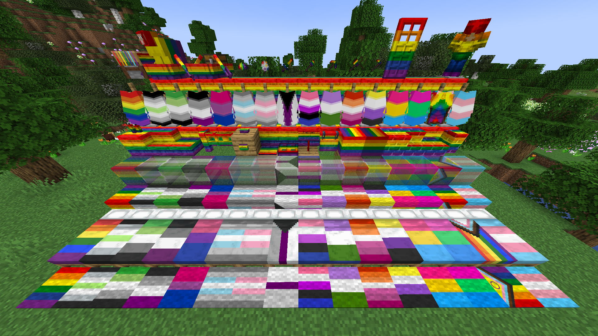

# Pride Land

Multi-loader Minecraft mod adding LGBTQIA+ themed blocks, decorations, and tools to the game.

## Screenshots

## About

The goal of this mod is to provide a bunch of LGBTQIA+ blocks, decorations, tools, and whatever else one could want with their pride flag on it.

## Features

- Rainbow versions of wool, carpets, stained glass and glass panes, concrete and concrete powder, terracotta, candles, bricks (with stairs, slabs, and walls), planks (with stairs and slabs), and beds
- 16 pride flag variants for beds and elytra
- Rainbow Crafting Station with rainbow dye
- Rainbow sheep with per-biome spawning toggles (64 vanilla biomes, five enabled by default)
- Rainbow signs and boats
- Config screen: Cloth Config with a ModMenu button on Fabric and Quilt, the native NeoForge screen on 26.x

Required dependencies:

- [Fabric API](https://modrinth.com/mod/fabric-api) (Fabric and Quilt builds)
- [Cloth Config API](https://modrinth.com/mod/cloth-config) (all loaders except 26.x NeoForge, which uses the native config screen)
- [Architectury API](https://modrinth.com/mod/architectury-api) for most versions

Optional: [ModMenu](https://modrinth.com/mod/modmenu) adds the config screen button on Fabric and Quilt.

## Compatibility

| Minecraft | Loaders |
|---|---|
| 1.20.1 | Fabric, Forge, Quilt |
| 1.20.2 | Fabric, Forge |
| 1.20.3 | Fabric |
| 1.20.4 | Fabric, Forge, Quilt |
| 1.21.1 | Fabric, NeoForge, Quilt |
| 1.21.2 - 1.21.10 | Fabric, NeoForge, Quilt |
| 1.21.11 | Fabric, NeoForge, Quilt |
| 26.2 | Fabric, NeoForge |

### Recipe viewing

The mod is generally compatible with every recipe viewing mod made for this purpose. The only incompatibility arises with *Rainbow Crafting* recipes, as they cannot be added automatically. REI and EMI integrations are compile-only and apply to versions where those mods exist. JEI cannot be fully supported because an upstream API bug prevents Fabric mods from using it - [link to the issue](https://github.com/mezz/JustEnoughItems/issues/3451).

## Future

The constitutive goal will be to add:

- rainbow versions of more blocks/items/entities
- 16 flags support to more blocks/items
- more flags in general

There is also a possibility of adding a whole new pride dimension with mobs, trees, ores etc turned into rainbow/flag versions. Making and maintaining such a project would require time and dedication that is not currently available, so far-reaching plans of that kind would need more people working on it.

## Limitations

- Not feature complete: content is added over time.
- Older versions (1.16.5, 1.17.1, 1.18.2) are not supported.
- Rainbow Crafting recipes cannot be shown in recipe viewers automatically.
- JEI is not supported due to the upstream API issue.
- EMI and REI integrations are compile-only and only where those mods exist for the version.

## Contribution

If you are willing to help add more content or port the mod, contact me on discord: nerlow

## License

[MIT](LICENSE)
